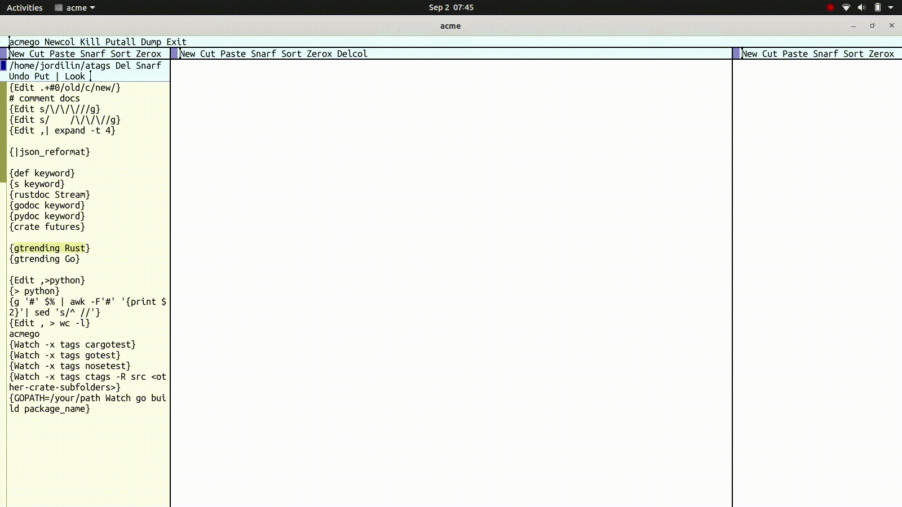

# pclone, parallel git clone for acme

The idea is that you have some URLs in one window, select and pipe
them into pclone to parallel clone them into a directory. A screencast
is worth more than a thousand words:

[]

## License

This project is licensed under either of

* Apache License, Version 2.0, ([LICENSE-APACHE](LICENSE-APACHE) or [http://www.apache.org/licenses/LICENSE-2.0](http://www.apache.org/licenses/LICENSE-2.0))
* MIT license ([LICENSE-MIT](LICENSE-MIT) or [http://opensource.org/licenses/MIT](http://opensource.org/licenses/MIT))

at your option.
